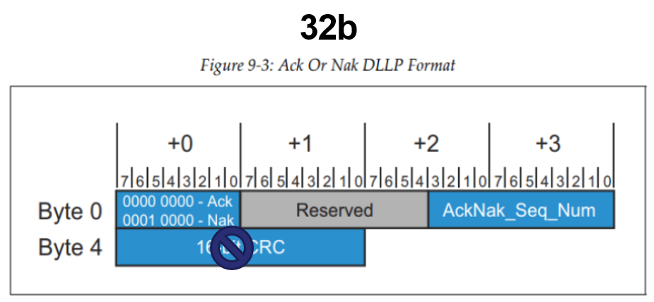

# 2024 URP PCIe Controller Design

## Authors (TAs)

- **Junseung Lee**  
  Department of Electrical and Computer Engineering, Sungkyunkwan University  
  [junseung0728@naver.com](mailto:junseung0728@naver.com)

- **Yoojin Kim**  
  Department of Electrical and Computer Engineering, Sungkyunkwan University  
  [g24067yjs@g.skku.edu](mailto:g24067yjs@g.skku.edu)

- **Giyong Jung**  
  Department of Electrical and Computer Engineering, Sungkyunkwan University  
  [jyk2498@gmail.com](mailto:jyk2498@gmail.com)

---

## Project Overview

In this project, we implemented a basic PCIe controller that is broadly divided into two main components: the **transmitter (Tx)** and the **receiver (Rx)**. Both the transmitter and receiver include the **transaction layer** and the **data link layer**.

## Overall System Architecture

The diagram above illustrates the overall system architecture of our PCIe controller design.

## TLP (Transaction Layer Packet) Structure

The TLP structure is essential for transmitting data between the PCIe transaction layers. This section details the composition of transaction layer packets.

## DLLP (Data Link Layer Packet) Structure

    

The DLLP structure is used within the data link layer for packet integrity and flow control. The above diagram shows the fundamental components of DLLPs.

---

Each section provides an in-depth look at the PCIe controller’s design, with a focus on the TLP and DLLP structures in both transmission and reception processes. This README serves as an introductory guide to understanding the architecture and fundamental packet structures within the project!.

---

## Acknowledgments

Special thanks to **Yujin Lim** for her invaluable assistance and support throughout this project.
